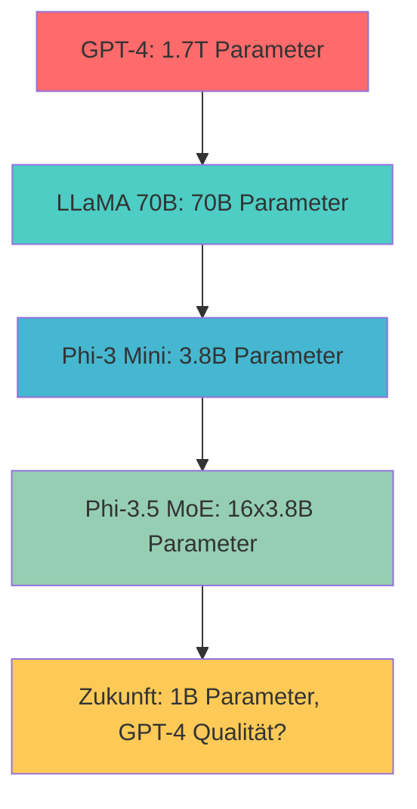

# Blick nach vorn

---

## Multi-Modal wird lokal

<div class="grid grid-cols-2 gap-8">

<div>

### 👀 **Vision Models**
- **LLaVA:** Bilder verstehen und beschreiben
- **MiniCPM-V:** Kompakt, für Consumer Hardware
- **Qwen-VL:** Multilinguale Vision

</div>

<div v-click>

### 🎵 **Audio Integration**
- **Whisper:** Speech-to-Text lokal
- **Bark:** Text-to-Speech Generation
- **MusicGen:** Musik aus Text

</div>

</div>

<v-click>

<div class="mt-6 p-4 bg-gradient-to-r from-green-100 to-blue-100 rounded-lg color-black">
<strong>🚀 Vision 2025:</strong> Ein lokales System für Text, Bild, Audio und Video
</div>

</v-click>

---

## Kleiner werdende Modelle

<div class="text-center">



</div>

<v-click>

### 🧠 **Techniques**
- **Mixture of Experts (MoE):** Nur aktive Parameter nutzen
- **Knowledge Distillation:** Große Modelle "unterrichten" kleine
- **Quantization:** 1-Bit Models (BitNet) kommen

</v-click>

<v-click>

<div class="mt-6 p-4 bg-yellow-100 rounded-lg text-center color-black">
<strong>Ziel:</strong> GPT-4-Level Performance auf Smartphone-Hardware
</div>

</v-click>

---

## Private RAG & Orchestrierung

<div class="grid grid-cols-2 gap-8">

<div>

### 📚 **Lokale RAG-Systeme**
- **Embeddings:** all-MiniLM, BGE-M3
- **Vector DBs:** ChromaDB, Qdrant, Weaviate
- **Documents:** PDFs, Wikis, Code-Repos
- **Privacy:** Alles bleibt lokal

</div>

<div v-click>

### 🔗 **LangChain Lokal**
- **Agents:** Planning, Tools, Memory
- **Chains:** Multi-Step Workflows  
- **Tools:** Web Search, Calculators, APIs
- **No Cloud:** Komplett lokale Orchestrierung

</div>

</div>

<v-click>

<div class="mt-6">

**Beispiel Use Case:**
```
Analysiere meine E-Mails → Finde relevante Dokumente → 
Erstelle Zusammenfassung → Generiere Antwort-Entwurf
```

</div>

</v-click>

---

## Hybrid-Ansatz: Das Beste aus beiden Welten

<div class="grid grid-cols-2 gap-8">

<div>

### 🏠 **Lokal für:**
- **Sensitive Daten:** Passwörter, Verträge, Medizin
- **Batch Processing:** Code-Generierung über Nacht
- **Development:** Coding-Assistenz, Refactoring
- **Offline:** Flugzeug, schlechte Verbindung

</div>

<div v-click>

### ☁️ **Cloud für:**
- **Complex Reasoning:** Mathematik, komplexe Logik
- **Latest Knowledge:** Aktuelle Events, neue APIs
- **High Throughput:** Viele parallele Anfragen
- **Latest Models:** GPT-o1, Claude 3.5 Opus

</div>

</div>

<v-click>

<div class="mt-6 p-4 bg-purple-100 rounded-lg color-black">
<strong>🎯 Smart Routing:</strong>
<ul>
<li>Einfache Fragen → Lokales 7B Modell</li>
<li>Code-Review → Lokales Code-Model</li>
<li>Komplexe Analyse → Cloud GPT-4</li>
<li>Sensitive Daten → Immer lokal</li>
</ul>
</div>

</v-click>

---

## Fazit: Die Zukunft ist hybrid

<v-clicks>

🎯 **2025 Prediction:**
- Lokal: 80% aller Developer-Tasks
- Cloud: 20% für komplexeste Probleme

📱 **Hardware-Trends:**
- Apple M4 mit 32GB unified memory als Standard
- NVIDIA RTX 5090 mit 32GB VRAM
- Specialized AI-Chips (Google TPU, Apple Neural Engine)

🌍 **Ecosystem:**
- Bessere Tools, einfachere Installation
- Enterprise-grade lokale LLM-Stacks
- Regulation treibt lokale Lösungen

💡 **Bottom Line:**
Local LLMs sind nicht mehr "Nice to have" – sie werden zum Standard für datensensitive Anwendungen

</v-clicks>

---

## Resources & Weiterführende Links

<div class="grid grid-cols-2 gap-8">

<div>

### 🔗 **Tools**
- [Ollama](https://ollama.ai/) - CLI für lokale LLMs
- [LM Studio](https://lmstudio.ai/) - GUI für Experimente
- [Continue](https://continue.dev/) - VSCode Integration
- [Aider](https://github.com/paul-gauthier/aider) - Terminal Coding

</div>

<div>

### 📚 **Lernen**
- [Hugging Face Course](https://huggingface.co/course/) - Deep Learning Basics
- [r/LocalLLaMA](https://reddit.com/r/LocalLLaMA) - Community
- [Papers with Code](https://paperswithcode.com/) - Latest Research
- [TheBloke](https://huggingface.co/TheBloke) - Quantized Models

</div>

</div>

<div class="text-center mt-8">
<h2>🤝 Q&A Zeit!</h2>
<p class="text-gray-600">Fragen, Diskussion, Erfahrungsaustausch</p>
</div>