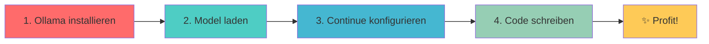

# Live-Demo: Coding-Integration

---

## Continue VSCode Plugin

<div class="grid grid-cols-2 gap-8">

<div>

### 🔌 **Was ist Continue?**
- GitHub Copilot Alternative
- Lokale + Cloud Models
- Autocompletion + Chat
- Open Source

</div>

<div v-click>

### ⚙️ **Setup**
1. VSCode Extension installieren
2. Config anpassen (`~/.continue/config.json`)
3. Ollama Model wählen
4. Fertig! 🎉

</div>

</div>

<v-click>

<div class="mt-6">

```json
{
  "models": [
    {
      "title": "LLaMA 3.1",
      "provider": "ollama",
      "model": "llama3.1:7b"
    }
  ]
}
```

</div>

</v-click>

---

## OpenCode – Chat + Code

<div class="grid grid-cols-2 gap-8">

<div>

### 💬 **Features**
- Code-bewusster Chat
- Datei-Kontext einbeziehen
- Refactoring-Vorschläge
- Multi-Language Support

</div>

<div v-click>

### 🚀 **Installation**
```bash
npm install -g @opencode/cli

# oder
pip install opencode

# Integration mit lokalem Modell
opencode --model ollama/llama3.1
```

</div>

</div>

<v-click>

<div class="mt-6 p-4 bg-purple-100 rounded-lg">
<strong>🎯 Use Cases:</strong> Code Review, Bug-Fixing, Refactoring, Dokumentation
</div>

</v-click>

---

## Demo-Szenario: "Von 0 zu LLM-Coding in 3 Minuten"

<div class="text-center">



</div>

<v-click>

### 🎬 **Live Demo Steps:**

<v-clicks>

1. **Ollama Setup** (30 Sekunden)
   ```bash
   curl -fsSL https://ollama.ai/install.sh | sh
   ollama pull phi3:mini
   ```

2. **VSCode Extension** (30 Sekunden)
   - Continue installieren
   - Konfiguration anpassen

3. **Code Generation** (2 Minuten)
   - React Component erstellen
   - Refactoring mit LLM
   - Bug-Fix mit Kontext

</v-clicks>

</v-click>

---

## Praktische Tipps

<div class="grid grid-cols-2 gap-8">

<div>

### ⚡ **Performance-Optimierung**
- **Kleines Modell** für Autocompletion (Phi-3 Mini)
- **Größeres Modell** für komplexe Tasks (LLaMA 7B)
- **GPU-Acceleration** aktivieren
- **Batch-Size** anpassen

</div>

<div v-click>

### 🧠 **Prompting-Strategien**
- **Kontext bereitstellen:** Dateien, Fehler, Ziele
- **Spezifisch sein:** "Refactor this function to use async/await"
- **Iterative Verbesserung:** Nachfragen, verfeinern
- **Code-Style** definieren: ESLint, Prettier

</div>

</div>

<v-click>

<div class="mt-6 p-4 bg-gradient-to-r from-blue-100 to-purple-100 rounded-lg">
<strong>🎯 Realistische Erwartungen:</strong>
<ul>
<li>✅ Boilerplate Code, einfache Funktionen</li>
<li>✅ Code-Erklärungen, Dokumentation</li>
<li>⚠️ Komplexe Algorithmen, Business-Logik</li>
<li>❌ Perfekter Code ohne Review</li>
</ul>
</div>

</v-click>

---

## Alternative Tools

<div class="grid grid-cols-3 gap-6">

<div>

### 🔧 **Aider**
- Terminal-basiert
- Git-Integration
- Multi-File Edits
```bash
pip install aider-chat
aider --model ollama/llama3.1
```

</div>

<div v-click>

### 🌐 **LocalGPT**
- Web Interface
- Document Chat
- RAG-Integration
```bash
git clone localGPT
python ingest.py
python run_localGPT.py
```

</div>

<div v-click>

### ⚡ **Tabby**
- Self-hosted Copilot
- Team-Deployment
- Fine-tuning Support
```bash
docker run -it tabbyml/tabby
```

</div>

</div>