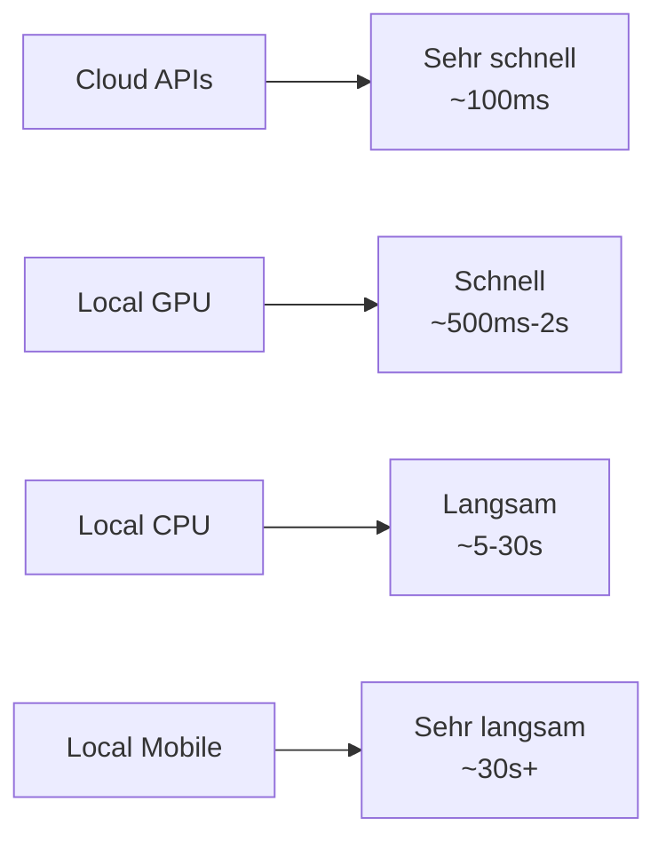

# State of the Art – Wo stehen wir?

---

## Überblick: Die wichtigsten Modelle

### 🦙 **LLaMA 3.1**
- **Größen:** 7B, 70B, 405B
- **Highlight:** Sehr gute Code-Generation
- **Hardware:** 8GB - 200GB+ RAM

### 🌪️ **Mistral & Mixtral**  
- **Mistral 7B:** Kompakt, schnell
- **Mixtral 8x7B:** Mixture-of-Experts
- **Hardware:** 8GB - 48GB RAM

### 🔬 **Phi-3**
- **Microsoft Research**
- **Phi-3 Mini:** 3.8B Parameter
- **Highlight:** Sehr effizient, kleine Modelle

### 🔥 **gpt-oss (DeepSeek-R1)**
- **Aktueller Hype-Train**
- **Reasoning-fokussiert**
- **Ähnlich zu o1-Preview**

---

## Benchmarks & ihre Aussagekraft

| Modell | MMLU | HumanEval | RAM | Besonderheit |
|--------|------|-----------|-----|--------------|
| **LLaMA 3.1 7B** | 69.4% | 60.4% | 8GB | Allrounder |
| **Mistral 7B** | 64.1% | 40.2% | 8GB | Schnell |
| **Phi-3 Mini** | 69.1% | 61.0% | 4GB | Effizient |
| **gpt-oss** | ~78%* | ~65%* | 16GB | Reasoning |

<v-click>

<strong>⚠️ Vorsicht bei Benchmarks:</strong>
<ul>
<li>Synthetic Tasks ≠ Real-World Performance</li>
<li>Benchmark-Hacking möglich</li>
<li>Domain-spezifische Performance variiert stark</li>
</ul>

</v-click>

---

## Hardware-Anforderungen

### 💻 **MacBook M-Serie**
- **M1/M2/M3:** 16GB RAM → 7B Modelle
- **M1/M2/M3 Pro:** 32GB RAM → 13B Modelle  
- **M1/M2 Ultra:** 64-128GB → 70B+ Modelle

<v-click>

**Vorteil:** Unified Memory, sehr effizient

</v-click>

### 🎮 **Gaming PC**
- **RTX 3080:** 10GB VRAM → 7B
- **RTX 4080:** 16GB VRAM → 13B
- **RTX 4090:** 24GB VRAM → 70B (quantized)

**Vorteil:** Sehr schnelle Inferenz

### 🖥️ **Kleine Server**
- **128GB RAM:** Mehrere 70B Modelle
- **AMD Threadripper:** Viele CPU-Kerne
- **Server-GPUs:** A100, H100 für Enterprise

**Vorteil:** Multi-User, hoher Durchsatz

---

## Performance-Vergleich

<v-click>

<strong>✅ Wann ist lokal gut?</strong>
<ul>
<li>Batch-Processing</li>
<li>Asynchrone Anwendungen</li>
<li>Nicht-interaktive Tasks</li>
</ul>

<strong>❌ Wann ist lokal schwierig?</strong>
<ul>
<li>Echtzeit-Chat</li>
<li>Hoher Durchsatz</li>
<li>Mobile Anwendungen</li>
</ul>

</v-click>